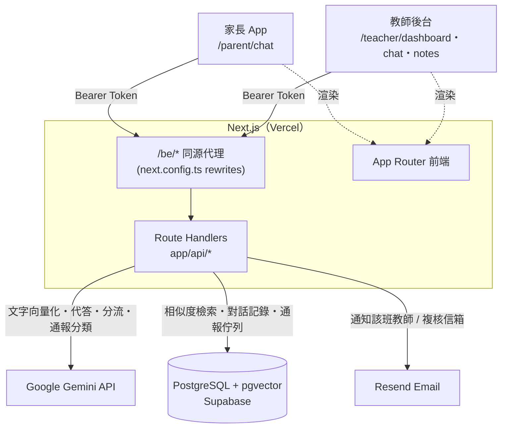

# Guidoo

## 問題與目標

根據民調結果，國中小教師平均每天工作長達 10 小時，其中有 2.5 小時耗費在下班後的隱形勞動，導致教師快樂指數降至 5 分，甚至有三成教師不到 4 分。為了解決這個問題，我們開發了 Guidoo 平台 —— 以 AI Agent 作為教師下班後的「虛擬分身」，他可以在家長傳訊息聯絡老師時智慧分析家長訊息：若家長訊息內容有關學校規章、活動等「客觀事實」，Agent 會直接代為精準應答；若涉及學生輔導或親師爭議等「複雜非事實問題」，則會自動梳理訴求、提煉摘要並分流給導師；若偵測到法規要求之通報事件，更會即時標記緊急程度發出警示。在守護教育專業界線的同時，真正為教師減輕負擔、提升快樂指數，緩解教育界人才流失的社會問題。

## 核心功能

- **AI 代答（客觀事實）** — 家長在對話中提問後，系統將問題向量化，於教師備注（`notes`）與班務事件（`facts`）中做相似度檢索，僅根據檢索到的內容以繁體中文直接回覆課表、活動、攜帶物品等低風險事務性問題，不引用任何外部知識。
- **自動分流與摘要（複雜非事實問題）** — 當問題涉及親師爭議、學生情緒或輔導、或語氣急迫時，Agent 不直接回答，而是產生原因摘要、建立分流案件（`escalations`），並以 Email 通知該班教師；家長端則收到「已通知老師」的暫代回覆。
- **法定通報偵測與警示** — 針對台灣九類法定通報情形，在「家長提問當下」與「教師寫下備注當下」兩個時間點各做一次分類，命中即標記緊急程度、寫入通報佇列並寄信給校方複核信箱。系統只做標記與提醒人工複核，不會自動對外通報，也不會在給家長的回覆中透露分類。
- **教師總表（待辦）** — 分流與通報案件化為待辦卡片，依風險（法定通報 / 分數）標示 urgent・watch・info 三級顏色，每張卡片可直接跳到該學生的聊天室；標記「處理完畢」後從清單隱藏。
- **雙角色聊天室** — 家長端為單一行動裝置對話畫面，教師端為多對話收件匣，兩者共用同一份訊息資料；教師可略過 AI 直接在對話中回覆，家長會看到回覆教師的姓名。
- **教師填寫事項** — 以分類、日期、學生為結構的備注 / 事件輸入介面，寫入後即向量化並成為 AI 代答的知識來源。

## 系統架構



**協作方式**

- **前端**：Next.js App Router。教師端三個分頁（總表 / 聊天室 / 填寫事項）與家長端單一對話畫面，登入後將 Bearer Token 與使用者資料存在 `localStorage`。所有請求打向同源 `/be/*`，由 `next.config.ts` 的 rewrites 代理到後端（`BACKEND_API_URL`，預設 `https://guidoo-be.vercel.app`），避免 CORS。
- **後端**：Next.js Route Handlers（`app/api/*`，Node runtime）。每個 handler 先 `requireSession()` 驗證自簽 Token 與角色，再透過 `lib/permissions.ts` 檢查該使用者對該學生 / 班級 / 學校的存取權。
- **模型**：`lib/gemini.ts` 封裝兩種呼叫 —— `embed()` 產生 1536 維向量供 pgvector 檢索；`callLLM()` / `classifyNoteForLegalReporting()` 以固定 JSON schema 取回 `{ answer, escalate, score, reason, legalFlag, legalCategory }`。
- **資料庫**：PostgreSQL（Supabase 託管）並啟用 pgvector。主要資料表：`users` / `students` / `classes` / `parent_student` / `teacher_class`（身分與關聯）、`notes` / `facts`（含向量欄位的知識來源）、`messages`（家長 · 教師 · 助理三方對話）、`escalations`（分流與法定通報佇列）。
- **外部服務**：Google Gemini（代答與分類）、Resend（分流 / 通報 Email 通知）、Vercel（前後端一併部署）。

**家長提問流程**：`POST /api/chat` → 驗證家長擁有該學生 → `embed(問題)` → 於範圍內 `notes` 做向量檢索 + 取近期 `facts` 與最近 6 則對話 → `callLLM()` → `escalate=false` 直接回傳答案並存為助理訊息；`escalate=true` 則建立 `escalations`、寄信給該班教師（`legalFlag` 時信件主旨加註「依法通報疑慮」），家長收到暫代回覆。

**教師寫備注流程**：`POST /api/notes` → 權限檢查 → `embed(內容)` 後寫入 `notes`；若為學生層級備注，額外呼叫 `classifyNoteForLegalReporting()`，命中法定通報類型即建立 `escalations` 並寄信給 `LEGAL_REPORTING_EMAIL`。

## 使用技術

| 類型 | 技術／服務 | 用途 |
| --- | --- | --- |
| AI 模型 | Google Gemini（`@google/genai`） | `gemini-3.1-flash-lite` 產生代答、分流判斷與法定通報分類（`responseSchema` 結構化輸出）；`gemini-embedding-001`（1536 維）將教師備注與事件向量化 |
| 前端 | Next.js 16（App Router）、React 19、TypeScript、Tailwind CSS v4、`next/font`（Geist、Quicksand） | 教師端（總表 / 聊天室 / 填寫事項）與家長端（單一對話畫面）介面、登入流程、身分切換 |
| 後端 | Next.js Route Handlers（Node runtime）、`postgres`（porsager）、`bcryptjs`、自簽 HMAC-SHA256 Bearer Token（`lib/auth.ts`） | `/api/*` 端點：登入、聊天、備注、事件、教師總表、通報結案；逐路由的角色與資料範圍授權（`lib/permissions.ts`） |
| Sponsor 技術 | Supabase、Resend | Supabase 提供 PostgreSQL + pgvector（向量檢索、對話與通報資料）；Resend 於分流與法定通報疑慮時寄送 Email 給教師或校方複核信箱 |
| 部署 | Vercel | 前端與 API 一併部署；`next.config.ts` rewrites 將 `/be/*` 代理至後端網址 |

## 安裝與執行

```bash
# 1. 安裝相依套件
npm install
# 註：目前 package.json 尚未列入後端執行套件，請一併安裝：
npm install postgres @google/genai resend bcryptjs

# 2. 設定環境變數
cp .env.local.example .env.local
# 於 .env.local 填入：
#   DATABASE_URL           Supabase Postgres 連線字串（需已啟用 pgvector extension）
#   GEMINI_API_KEY         Google AI Studio 金鑰
#   RESEND_API_KEY         Resend 金鑰
#   LEGAL_REPORTING_EMAIL  法定通報疑慮的人工複核信箱
#   SESSION_SECRET         任意隨機字串，用於簽章登入 Token
#   BACKEND_API_URL        （選填）本機自測時指向自身，如 http://localhost:3000

# 3. 建立資料庫結構
#   在 Supabase 執行：啟用 pgvector，建立 users / students / classes /
#   parent_student / teacher_class / notes / facts / messages / escalations
#   等資料表（notes.embedding、facts 的向量欄位需為 vector(1536)），並匯入示範資料與
#   demo 帳號密碼雜湊。

# 4. 啟動開發伺服器
npm run dev            # http://localhost:3000

# 5. 建置與啟動正式版本
npm run build
npm run start
```

示範帳號（密碼皆為 `demo1234`）：教師 `teacher.chen@example.tw`、家長 `parent10@example.tw`。首頁會自動導向 `/login`。

## 作品展示

- 作品展示網址（選填）：
- 評選影片：

## 限制與未來工作

- **驗證機制簡化**：登入採自簽 HMAC Token 存於 `localStorage`，正式環境應改用成熟的驗證方案與 HttpOnly Cookie。
- **部分狀態僅存在前端**：聊天室的「刪除對話」、教師總表的待辦「處理完畢 / 隱藏」目前只寫入瀏覽器 `localStorage`，不會回寫後端。
- **法定通報為人工把關**：系統只做「標記 + 通知複核」，不會自動對外通報；分類完全依賴 LLM 判斷，需人工確認。
- **檢索範圍**：RAG 以單一學生 / 班級 / 學校為範圍，尚未處理跨班導師、代課、共同授課等複雜權限情境。
- **相依與測試**：`package.json` 需補齊後端執行套件宣告；專案目前無自動化測試。
- **模型版本**：Gemini 的 model id 常隨版本更動，呼叫失敗時需至 Google AI Studio 確認（見 `lib/gemini.ts` 註解）。
- **後續方向**：教師備注批次匯入、家長端推播通知、通報案件的稽核軌跡、多語系、將前端本地狀態遷移到後端持久化。

## 第三方服務、資料與素材

- Database : Supabase
- Email API： Resend
- AI／Embedding：Google Gemini API（Google AI Studio）
- 部署平台：Vercel
- 字體：Geist、Geist Mono、Quicksand（Google Fonts，透過 `next/font` 載入）
- 圖示與插圖：專案內自繪 SVG（`components/`、`public/`）
- 示範資料（學生 / 班級 / 對話）為虛構，不含真實個資
- 不提交任何金鑰、Token 或個人資料；環境變數請參考 `.env.local.example`

## 團隊成員

| 姓名 | 分工 |
| --- | --- |
| Cedric Lam | 後端 API、資料庫結構、AI 代答／分流／法定通報邏輯 |
| Nancy Lin | 前端介面、教師端畫面 |
| Ray | 前端介面、登入流程、教師總表與聊天室整合 |

（成員與分工請依實際情況調整）

## License

本專案尚未加入正式授權條款。建議於儲存庫根目錄新增 `LICENSE` 檔案（例如 MIT），並在此標示授權名稱。
